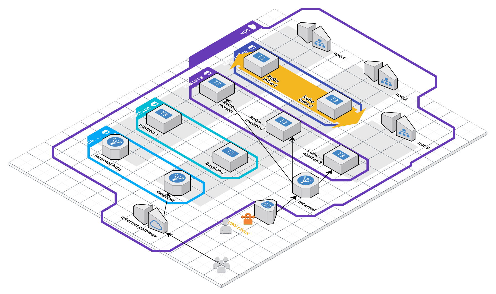

# Fury Kubernetes AWS

## what is fury kuberneters for AWS?

- what problems does it solve?
  ...

- what does "production ready" really means means

  TBD

### reference architecture


cloudcraft diagram [here](https://cloudcraft.co/view/ee4cd783-8f91-430b-85e3-255173b331e2?key=mvgzlsrnDoemUZKEykXX6Q)

#### Instances

- 2 bastions in different availability-zones
- 3 k8s master nodes in different availability-zones
- 2 k8s worker nodes in different availability-zones

#### Networking

- The incoming public incoming traffic will be routed into the pods services via an application load balancer
- 2 bastions machines are available in order to proxy commands from outside the cluste to the k8s master nodes via _ssh_
- VPN connection allow connecting directly to master nodes and worker nodes

### differences with installations using kubeadm

etcd is not managed by k8s (not running in a pod)
but is under systemd

...

TBD

---

## Features

Production ready multi-master setup

...

TBD

## prerequisites

there programs needs to be installed locally and available in `$PATH`

- install [furyctl](https://github.com/sighup-io/furyctl#install)
- install awscli
- install [furyagent](https://github.com/sighup-io/furyagent#install)
- install ansible
- install kustomize v1 (v2 is incompatible at the moment)
- install terraform
- install openvpn

---

## step-by-step cluster setup instructions

create a new empty folder for the project and _cd_ into it

run `mkdir [project_name]`

---

## Declaring dependencies in Furyfile

Create a _Furyfile_ in the project root with commons and AWS specific dependencies by running

> _Furyfile_ is used by _furyctl_ to download dependencies, for more info check [_furyctl's readme_](https://github.com/sighup-io/furyctl)

> _bases_ are manifests files for kubernetes
> _roles_ are terraform files
> _bases_ are ansible playbooks or tasks

```
cat <<-EOF > Furyfile.yml
bases:
  - name: aws/weave-net
    version: master
  - name: aws/storageclass
    version: master

roles:
  - name: aws/etcd
    version: master
  - name: aws/furyagent
    version: master
  - name: aws/kube-control-plane
    version: master
  - name: aws/kube-node-common
    version: master
  - name: aws/kube-worker
    version: master
  - name: openvpn/openvpn
    version: master

modules:
  - name: aws/aws-vpc
    version: master
  - name: aws/aws-kubernetes
    version: master
  - name: aws/s3-furyagent
    version: master
EOF

```

## Installing dependencies with furyctl

run `furyctl install` while in the project root

it will create a folder called _vendor_ and download dependencies defined in _Furyfile_ inside it

---

Create the S3 bucket for the terraform state

using the _aws_ cli

```
export TERRAFORM_STATE_BUCKET_NAME=fury-tf-state
aws s3 mb s3://${TERRAFORM_STATE_BUCKET_NAME} --region eu-west-1
```

> change `fury-tf-state` with custom name and region

---

## scaffold folders

run

```
mkdir {secrets,terraform,ansible,manifests}
```

project folder should now look like this:

```
project_root
    ├── Furyfile.yml
    ├── ansible
    ├── secrets
    ├── terraform
    └── vendor
```

> we create these folders now because the output of some terraform command will create files in the ansible folder and

---

## Secrets

NB: the _secrets_ will contains all the keys and token required to operate the cluster, is **highly encouraged** to encrypt this folder before pushing it to a remote repository using something like [git-crypt](https://github.com/AGWA/git-crypt)

create file with aws credentials running this command

```
touch secrets/aws-credentials.sh  && \
echo export AWS_ACCESS_KEY_ID=$(aws configure get aws_access_key_id --profile [AWS_PROFILE]) >> secrets/aws-credentials.sh  && \
echo export AWS_SECRET_ACCESS_KEY=$(aws configure get aws_secret_access_key --profile [AWS_PROFILE]) >> secrets/aws-credentials.sh
```

> change [AWS_PROFILE] with you profile name or remove the `profile` flag to use default user

a file is created at _secrets/aws-credentials.sh_
open it and set **AWS_ACCESS_KEY_ID** and **AWS_SECRET_ACCESS_KEY**

> these credential are use by terraform to create the cluster

---

## setup terraform state backend

create file for terraform backend

```
cat <<-EOF > terraform/backend.tf
terraform {
  backend "s3" {
    bucket = "${TERRAFORM_STATE_BUCKET_NAME}"
    key    = "terraform"
    region = "eu-west-1"
  }

  required_version = ">= 0.11.11"
}
EOF
```

> the variable `TERRAFORM_STATE_BUCKET_NAME` was set in previous commands, in case you are using a different shell session and the env is not initialed change it with the name of the bucket previously created and set the region accordingly

---

## create ssh credential

create new ssh credential to be used key for accessing the new machines

> this step is not mandatory, you can use your own key, but for the sake fo semplicity we generate a new one

run this in the project root

`ssh-keygen -t rsa -b 4096 -f ./secrets/ssh-user`

---

### Optional: additional ssh keys

additional ssh keys can be added when creating the machines by adding them in `terraform/keys` folder
one key per file

`mkdir terraform/keys`

example using github
`curl https://github.com/kandros.keys > terraform/keys/jaga.pub`

example using local key
`cat ~/.ssh/id_rsa.pub > terraform/keys/user.pub`

> all the keys found in _terraform/keys_ will be added to the machines in order to ssh into them

---

## Using a Makefile

create Makefile for terraform operations

> in order to semplify the complexity of bootstrapping the infrastructure, we will create a _Makefile_ with operation already in the correct order

```
cat <<-'EOF' > ./terraform/Makefile
creds = ../secrets/aws-credentials.sh

.PHONY: init plan run destroy

init:
	source $(creds) && terraform init

plan:
	source $(creds) && terraform validate && terraform plan

apply:
	source $(creds) && terraform apply -auto-approve

run:
	source $(creds) && terraform apply -auto-approve
	source $(creds) && mkdir -p ../ansible && terraform output -module=k8s inventory > ../ansible/hosts.ini
	source $(creds) && terraform output -module=k8s ecr-pusher > ../secrets/ecr.sh
	source $(creds) && terraform output -module=prod-furyagent furyagent_ansible_secrets > ../secrets/fury.yml

destroy:
	source $(creds) && terraform destroy

dep:
	cd .. && $(MAKE) dep
EOF
```

---

## Create aws VPC using terraform

Create file with terraform VPC

> change the variable `name` as it would be used for namespace or prefix the instances

```
cat <<- 'EOF' > terraform/main.tf
variable aws_region {
  default = "eu-west-1"
}

provider "aws" {
  region  = "${var.aws_region}"
  version = "1.60.0"
}

variable name {
  default = "try-fury"
}

variable env {
  default = "test"
}

variable ssh-public-key {
  default = "../secrets/ssh-user.pub"
}

variable ssh-private-key {
  default = "../secrets/ssh-user"
}

module "vpc" {
  source        = "../vendor/modules/aws/aws-vpc"
  name          = "${var.name}"
  env           = "${var.env}"
  vpc-cidr      = "10.100.0.0/16"
  region        = "${var.aws_region}"
  internal-zone = "sighup.io"
  bastion-ami   = "ubuntu/images/hvm-ssd/ubuntu-bionic-18.04-amd64-server-20190212.1-*"

  ssh-public-keys = [
    # examples to add additions keys
    # "${file("keys/user.pub")}"
    "${file(var.ssh-public-key)}",
  ]
}
EOF
```

> make sure to edit the `vpc.ssh-public-keys` if you need additional public ssh keys added to the machines

---

## bootstrap the cluster

run these commands

`cd terraform`  
`make init`

---

### Optional: check terraform plan

from _terraform_ folder
run `make plan`

to validate plan and validate the configuration of terraform

---

run `make apply`

> this will setup the VPC and on aws with terraform

---

## Create nodes

append k8s module to `terraform/main.tf`

> this is splitted from the previous `make run` because the module k8s property needs to get dynamic data from the first run

```
cat <<- 'EOF' >> terraform/main.tf

module "k8s" {
  source                             = "../vendor/modules/aws/aws-kubernetes"
  region                             = "${var.aws_region}"
  name                               = "${var.name}"
  env                                = "${var.env}"
  kube-ami                           = "ubuntu/images/hvm-ssd/ubuntu-bionic-18.04-amd64-server-20190212.1-*"
  kube-master-count                  = 3
  kube-master-type                   = "t3.medium"
  kube-private-subnets               = "${module.vpc.private_subnets}"
  kube-public-subnets                = "${module.vpc.public_subnets}"
  kube-domain                        = "${module.vpc.domain_zone}"
  kube-bastions                      = "${module.vpc.bastion_public_ip}"
  ssh-private-key                    = "${var.ssh-private-key}"

  kube-lb-internal-domains = [
    "grafana",
    "prometheus",
    "alertmanager",
    "kibana",
    "cerebro",
    "directory",
  ]

  kube-lb-external-enable-access-log = false

  kube-workers = [
    {
      kind  = "infra"
      count = 2
      type  = "t3.medium"
    },
  ]

  ecr-repositories = []

  kube-workers-security-group = [
    {
      type        = "ingress"
      to_port     = 32080
      from_port   = 32080
      protocol    = "tcp"
      cidr_blocks = "0.0.0.0/0"
    },
  ]

  ssh-public-keys = [
    "${file(var.ssh-public-key)}",
  ]
}

module "prod-furyagent" {
  source                = "../vendor/modules/aws/s3-furyagent"
  cluster_name          = "${var.name}"
  environment           = "${var.env}"
  aws_region            = "eu-west-1"
  furyagent_bucket_name = "sighup-${var.name}-${var.env}-agent"
}
EOF
```

> make sure to edit the `k8s.ssh-public-keys` if you need additional ssh public keys added to the machines

run `make init && make run`

> this will create the machines on aws with terraform

> `make run` does terraform apply and also outpus files with stack info to be used by ansible

---

### Checkpoint

now everything is deployed on aws

> hosts.ini has been created by terraform's output in _ansible_ folder when we used `make run`

---

## Setup nodes using ansible

create ansible config file

```bash
cat <<-EOF > ./ansible/ansible.cfg
[defaults]
inventory = hosts.ini
host_key_checking = False
roles_path = ../vendor/roles
timeout = 60

# Use the YAML callback plugin.
stdout_callback = yaml
# Use the stdout_callback when running ad-hoc commands.
bin_ansible_callbacks = True
EOF
```

---

### checkpoint

verify that machies are reachable by ansible run `ansible all -m ping` while in the _ansible_ folder

---

## prepare cluster playbook

create ansible playbook to setup cluster

```bash
cat <<-'EOF' > ansible/cluster.yml
- name: Kubernetes node preparation
  hosts: master,nodes
  become: true
  roles:
    - aws/kube-node-common

- name: Installing and configuring furyagent
  hosts: master
  become: true
  vars:
    furyagent_configure_master: true
    furyagent_configure_etcd: true
    furyagent_etcd_backup: false
  vars_files:
    - '../secrets/fury.yml'
  roles:
    - aws/furyagent

- name: Etcd cluster preparation
  hosts: master
  become: true
  roles:
    - aws/etcd

- name: Control plane configuration
  hosts: master
  become: true
  vars:
    kubernetes_api_SAN:
      - '{{ public_lb_address }}'
    kubernetes_kubeconfig_path: '../secrets/users'
    kubernetes_cluster_name: 'fury-test'
    kubernetes_users_org: sighup
    kubernetes_control_plane_address: '{{control_plane_endpoint}}:6443'
  roles:
    - aws/kube-control-plane

- name: Kubernetes join nodes
  hosts: nodes
  become: true
  roles:
    - aws/kube-worker
EOF
```

---

## run cluster playbook

`cd` into ansible folder and run
run `ansible-playbook cluster.yml`

---

### checkpoint

try to ssh into a master to check that everythins is working properly
`ssh ubuntu@[MASTER_IP] -i ../secrets/ssh-user -o ProxyCommand="ssh -o StrictHostKeyChecking=no -W %h:%p -q -i ../secrets/ssh-user ubuntu@[BASTION_IP]"`

> the IPs for master node and bastion can be foundn in _ansible/hosts.init_

run `sudo su`
run `kubectl get node --kubeconfig /etc/kubernetes/admin.conf`

the output should look like

```
NAME                                          STATUS     ROLES    AGE     VERSION
ip-10-100-10-20.eu-west-1.compute.internal    NotReady   master   10m     v1.12.6
ip-10-100-10-253.eu-west-1.compute.internal   NotReady   <none>   9m16s   v1.12.6
ip-10-100-11-138.eu-west-1.compute.internal   NotReady   master   9m46s   v1.12.6
ip-10-100-11-201.eu-west-1.compute.internal   NotReady   <none>   9m16s   v1.12.6
ip-10-100-12-221.eu-west-1.compute.internal   NotReady   master   10m     v1.12.6
```

> the status is _NotReady_ because the NCI is not yet configured, but seeing the nodes is enough to prove we are good to continue

---

---

## prepare openpnv playbook

In order to communicate with the bastions and the nodes securely we setup a VPN

create playbook to setup openvpn

```
cat <<-EOF > ansible/openvpn.yml
- name: Installing and configuring openvpn certificate via furyagent
  hosts: bastion
  become: true
  vars:
    furyagent_configure_openvpn: true
  vars_files:
    - '../secrets/fury.yml'
  roles:
    - aws/furyagent

- name: Provisioning bastion hosts
  hosts: bastion
  become: true
  vars:
    openvpn_dns_servers:
      - "{{ dns_server }}"
    openvpn_remote_servers: "{{ groups['bastion'] | map('extract', hostvars, ['ansible_host']) | list }}"
    openvpn_client_config_local_dir: ../secrets/users/openvpn
    openvpn_users:
      - openvpn-user
  roles:
    - openvpn/openvpn
EOF
```

---

## run openpnv playbook

run `ansible-playbook openvpn.yml`

> this commands will create two files _secrets/users/openvpn/openvpn-user.conf_ and _secrets/openvpn-furyagent.yml_

---

## prepare furyagent to create vpn certificates

inside _secrets/openvpn-furyagent.yml_

add user to the list `clusterComponent.openvpn-client.users`

in the end it should like this

> openvpn-user is the same name used in _ansible/openvpn.yml_

```
storage:
  provider: s3
  url: 'http://s3-eu-west-1.amazonaws.com'
  aws_access_key: 'xxx'
  aws_secret_key: 'xxx'
  bucketName: 'sighup-try-aws-test-agent'
  region: 'eu-west-1'
clusterComponent:
  nodeName: ip-10-100-0-65
  openvpn:
    certDir: /etc/openvpn/pki
  openvpn-client:
    targetDir: ./secrets/openvp-clients
    users:
      - openvpn-user

```

---

## create vpn configurations

while in _ansible_ folder

run `furyagent configure openvpn-client --config ../secrets/openvpn-furyagent.yml`

---

## install the VPN on your local machine

install the vpn using the configuration found in _secrets/users/openvpn/openvpn-user/openvpn-user.conf_
following your tool instructions

for macos users using [tunnelblick](https://tunnelblick.net/cConfigT.html) the section **If you already have configuration file** shows the required steps

### Checkpoint

From now on you will be able to reach the nodes when running the VPN from your local machine

example command:
`kubectl --kubeconfig=secrets/users/admin.conf get nodes`

---

## prepare for using kustomize

create manifestes folders to hold k8s manifests files for _kustomize_

in the project root run  
`mkdir manifests`
create the file _manifests/kustomization.yaml_

```
cat <<-EOF > manifests/kustomization.yaml
bases:
EOF
```

---

## installing a NCI

install weave-net in k8s cluster

add to _manifests/kustomization.yaml_ in `bases`

```
- ../vendor/katalog/aws/weave-net
```

run `kustomize build manifests | kubectl apply -f - --kubeconfig=secrets/users/admin.conf` to deply

> if you encounter this error, this is expected, not need to worry about
> `error: unable to recognize "STDIN": no matches for kind "ServiceMonitor" in version "monitoring.coreos.com/v1"`

---

### checkpoint

at this point the cluster is setup with
2 bastion
3 master nodes running control _plane inside_ pods managed by k8s except for _etcd_ which runs under _systemd_
2 workes nodes

every machine is accessible by it's IP using then VPN (IPs are found in _ansible/hosts.ini_)

---

## Nest steps:

### install storage

install storage class for ebs in k8s cluster

add to _manifests/kustomization.yml_ in `bases`

```
- ../vendor/katalog/aws/storageclass
```

run `kustomize build manifests | kubectl apply -f - --kubeconfig=secrets/users/admin.conf` to deply

---

### FAQ

Q: where is cluster state stored?
A: the state of the cluster if manager by terraform and stored in a bucket on s3

Q: how can i use _kubectl_?
A: while the vpn is active, using `kubectl --kubeconfig=./secrets/users/admin.conf [command_here]` will send the command to a master node

## Teardown

to remove all resources created by **terraform**, run `make destroy` inside the _terrafom_ folder
