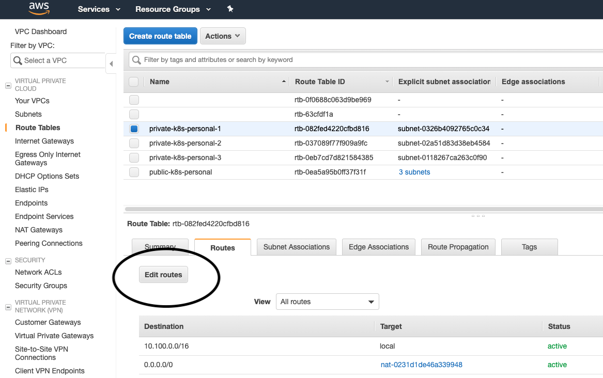
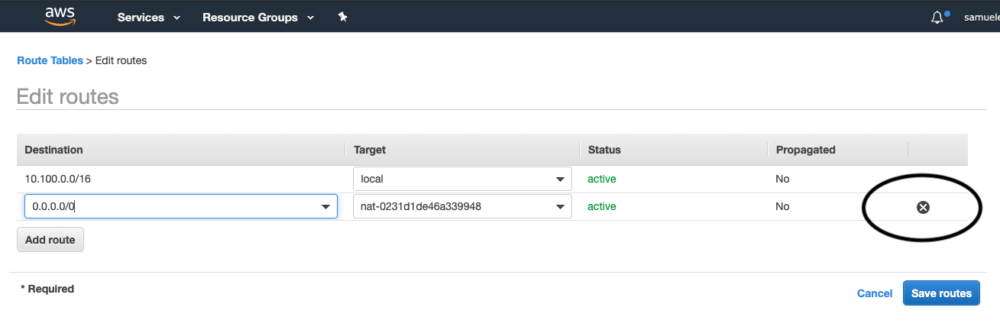

# Release notes

- [Release notes](#release-notes)
  - [Route table refactoring](#route-table-refactoring)
  
This version refactors how we manage route table rules on private and public route tables. The need is to remove the rules list from the aws_route_table terraform resource and to permit external route table edits (for example: adding a vpc peering connection).


## Route Table Refactoring

### Issue

Cannot customize route table rules with external terraform projects

### Change

Removed route object from aws_route_table public and private. Created the corresponding resources aws_route public and private.

#### How to upgrade vpc module

The upgrade path needs manual intervention on the AWS side.

Run `source ../../secrets/var.sh && terraform plan -target=module.vpc -out=terraform.plan`

You will have an output similar to this one:

```bash
Terraform will perform the following actions:                                                                                                                                                                                                        
                                                                                                                                                                                                                                                     
  + module.vpc.aws_route.main                                                                                                                                                                                                                        
      id:                         <computed>                                                                                                                                                                                                         
      destination_cidr_block:     "0.0.0.0/0"                                                                                                                                                                                                        
      destination_prefix_list_id: <computed>                                                                                                                                                                                                         
      egress_only_gateway_id:     <computed>
      gateway_id:                 "igw-0d5a546b7e10126c2"
      instance_id:                <computed>
      instance_owner_id:          <computed>
      nat_gateway_id:             <computed>
      network_interface_id:       <computed>
      origin:                     <computed>
      route_table_id:             "rtb-0ea5a95b0ff37f31f"
      state:                      <computed>

  + module.vpc.aws_route.private[0]
      id:                         <computed>
      destination_cidr_block:     "0.0.0.0/0"
      destination_prefix_list_id: <computed>
      egress_only_gateway_id:     <computed>
      gateway_id:                 <computed>
      instance_id:                <computed>
      instance_owner_id:          <computed>
      nat_gateway_id:             "nat-0231d1de46a339948"
      network_interface_id:       <computed>
      origin:                     <computed>
      route_table_id:             "rtb-082fed4220cfbd816"
      state:                      <computed>

  + module.vpc.aws_route.private[1]
      id:                         <computed>
      destination_cidr_block:     "0.0.0.0/0"
      destination_prefix_list_id: <computed>
      egress_only_gateway_id:     <computed>
      gateway_id:                 <computed>
      instance_id:                <computed>
      instance_owner_id:          <computed>
      nat_gateway_id:             "nat-07be80e28205de314"
      network_interface_id:       <computed>
      origin:                     <computed>
      route_table_id:             "rtb-037089f77f909a9fc"
      state:                      <computed>

  + module.vpc.aws_route.private[2]
      id:                         <computed>
      destination_cidr_block:     "0.0.0.0/0"
      destination_prefix_list_id: <computed>
      egress_only_gateway_id:     <computed>
      gateway_id:                 <computed>
      instance_id:                <computed>
      instance_owner_id:          <computed>
      nat_gateway_id:             "nat-05ea5011ea2bd8d39"
      network_interface_id:       <computed>
      origin:                     <computed>
      route_table_id:             "rtb-0eb7cd7d821584385"
      state:                      <computed>


Plan: 4 to add, 0 to change, 0 to destroy.
```

The old egress route entries must be removed from the current route tables (only private is needed, public is taken care by terraform).

Now go on AWS console and delete all private nat egress routes:
 



 
then apply the plan:

```bash
source ../../secrets/var.sh && terraform fmt && terraform apply terraform.plan
module.vpc.aws_route.private[0]: Creating...
  destination_cidr_block:     "" => "0.0.0.0/0"
  destination_prefix_list_id: "" => "<computed>"
  egress_only_gateway_id:     "" => "<computed>"
  gateway_id:                 "" => "<computed>"
  instance_id:                "" => "<computed>"
  instance_owner_id:          "" => "<computed>"
  nat_gateway_id:             "" => "nat-0231d1de46a339948"
  network_interface_id:       "" => "<computed>"
  origin:                     "" => "<computed>"
  route_table_id:             "" => "rtb-082fed4220cfbd816"
  state:                      "" => "<computed>"
module.vpc.aws_route.main: Creating...
  destination_cidr_block:     "" => "0.0.0.0/0"
  destination_prefix_list_id: "" => "<computed>"
  egress_only_gateway_id:     "" => "<computed>"
  gateway_id:                 "" => "igw-0d5a546b7e10126c2"
  instance_id:                "" => "<computed>"
  instance_owner_id:          "" => "<computed>"
  nat_gateway_id:             "" => "<computed>"
  network_interface_id:       "" => "<computed>"
  origin:                     "" => "<computed>"
  route_table_id:             "" => "rtb-0ea5a95b0ff37f31f"
  state:                      "" => "<computed>"
module.vpc.aws_route.private[2]: Creating...
  destination_cidr_block:     "" => "0.0.0.0/0"
  destination_prefix_list_id: "" => "<computed>"
  egress_only_gateway_id:     "" => "<computed>"
  gateway_id:                 "" => "<computed>"
  instance_id:                "" => "<computed>"
  instance_owner_id:          "" => "<computed>"
  nat_gateway_id:             "" => "nat-05ea5011ea2bd8d39"
  network_interface_id:       "" => "<computed>"
  origin:                     "" => "<computed>"
  route_table_id:             "" => "rtb-0eb7cd7d821584385"
  state:                      "" => "<computed>"
module.vpc.aws_route.private[1]: Creating...
  destination_cidr_block:     "" => "0.0.0.0/0"
  destination_prefix_list_id: "" => "<computed>"
  egress_only_gateway_id:     "" => "<computed>"
  gateway_id:                 "" => "<computed>"
  instance_id:                "" => "<computed>"
  instance_owner_id:          "" => "<computed>"
  nat_gateway_id:             "" => "nat-07be80e28205de314"
  network_interface_id:       "" => "<computed>"
  origin:                     "" => "<computed>"
  route_table_id:             "" => "rtb-037089f77f909a9fc"
  state:                      "" => "<computed>"
module.vpc.aws_route.main: Creation complete after 1s (ID: r-rtb-0ea5a95b0ff37f31f1080289494)
module.vpc.aws_route.private[0]: Creation complete after 1s (ID: r-rtb-082fed4220cfbd8161080289494)
module.vpc.aws_route.private[1]: Creation complete after 1s (ID: r-rtb-037089f77f909a9fc1080289494)
module.vpc.aws_route.private[2]: Creation complete after 1s (ID: r-rtb-0eb7cd7d8215843851080289494)
```

1 minute egress down is expected (depends on how fast you are).